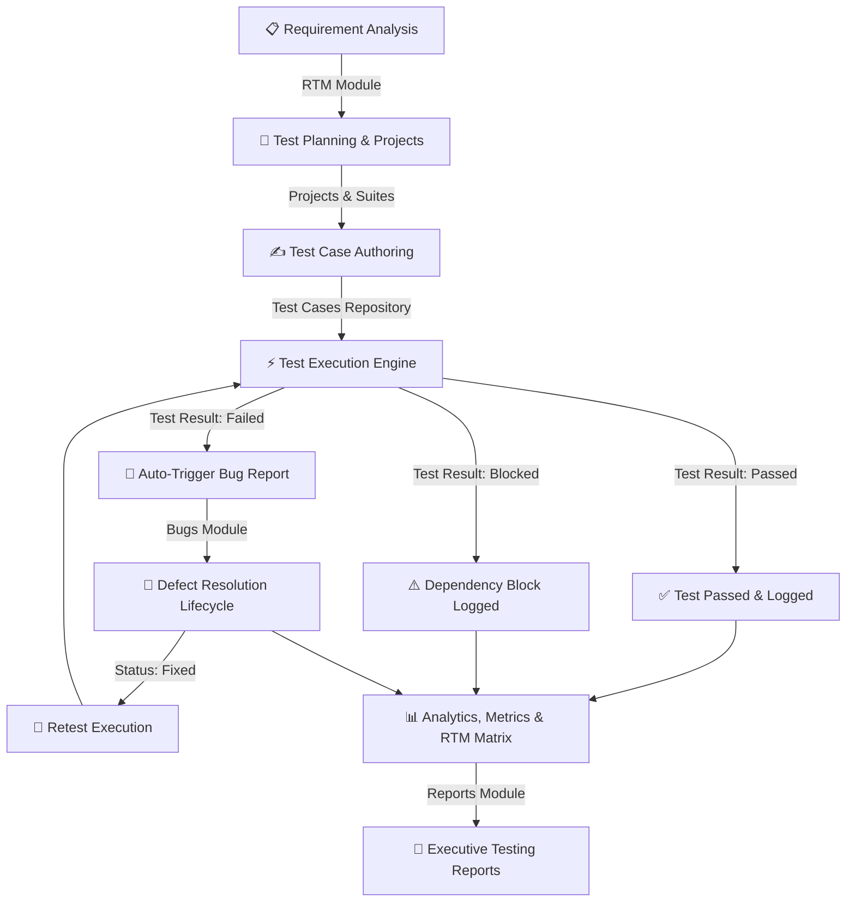

<div align="center">


</div>

<p>
  
  
  
  
  
  
</p>

<h3>🎯 Modern Web-Based Quality Assurance & Software Testing Suite</h3>

<p>
<i>Software Engineering & Quality Assurance Academic Project</i>
</p>

</div>


## 📑 Table of Contents

- [🌟 Live Key Features](#-live-key-features)
- [⚡ Quick Start & Demo Credentials](#-quick-start--demo-credentials)
- [🔄 Software Testing Life Cycle (STLC) Workflow](#-software-testing-life-cycle-stlc-workflow)
- [📊 System Architecture](#-system-architecture)
- [📂 Module Directory & Capabilities](#-module-directory--capabilities)
- [📈 Requirement Traceability Matrix (RTM)](#-requirement-traceability-matrix-rtm)
- [💾 LocalStorage Relational Architecture](#-localstorage-relational-architecture)
- [🧪 20 Comprehensive Self-Test Cases](#-20-comprehensive-self-test-cases)
- [🎓 SEQA Demonstration Script](#-seqa-demonstration-script)
- [🔮 Future Roadmap](#-future-roadmap)

---

## 🌟 Live Key Features

```
┌──────────────────────────────────────────────────────────────────────────────────────────┐
│  🟢 PROJECT MANAGEMENT     Create, Track Versions, Progress Bars, Milestones             │
│  🧪 TEST CASES REPOSITORY   Full CRUD, Multi-Filter, Search, Numbered Steps, Duplication  │
│  ⚡ EXECUTION RUNNER        Pass/Fail/Blocked Recording, Auto Bug Generation on Failure   │
│  📦 TEST SUITE BATCHER      Regression, Smoke, Sanity Suites with Pass Rate Calculation   │
│  🐛 DEFECT LIFECYCLE        Open ➔ Assigned ➔ In Progress ➔ Fixed ➔ Retest ➔ Closed       │
│  🔗 TRACEABILITY MATRIX     REQ ➔ TC ➔ BUG End-to-End Real-Time Coverage Analysis         │
│  📊 METRICS & REPORTING     Defect Density, Pass Rate, 9 Printable Reports & CSV Exports  │
│  🌗 THEME SYSTEM            Zero-Flicker Light & Dark Mode with LocalStorage Memory       │
│  👥 ROLE-BASED ACCESS       Admin (Full), QA Tester (Execution), Developer (Bug Fixes)    │
│  💾 ZERO SERVER / PORTABLE  Single-Folder Deployment, 100% Client-Side LocalStorage Engine│
└──────────────────────────────────────────────────────────────────────────────────────────┘
```

---

## ⚡ Quick Start & Demo Credentials

### 🚀 How to Run in 5 Seconds
1. **No Installation Needed**: No Node.js, Python, PHP, or local server required.
2. **Launch**: Double-click [`index.html`](file:///c:/Users/Kunal/OneDrive/Desktop/Software%20Test%20Case%20Management%20System/index.html) in your browser (Chrome, Edge, Firefox, Safari).
3. **Auto-Initialization**: On initial launch, the system seeds **3 Projects**, **10 Test Cases**, **5 Bugs**, **3 Test Suites**, **5 Users**, and **9 Requirements**.

### 🔑 Demo Logins

| Role | Username | Password | Privileges |
| :--- | :--- | :--- | :--- |
| 🛡️ **Administrator** | `admin` | `admin123` | Unrestricted access across all modules, team settings & data reset |
| 🧪 **QA Tester** | `tester` | `tester123` | Test case creation, execution, suite runner, bug reporting & reports |
| 💻 **Developer** | `developer` | `developer123` | Bug tracking, execution history audit, quality reports |

---

## 🔄 Software Testing Life Cycle (STLC) Workflow



---

## 📊 System Architecture

```
┌───────────────────────────────────────────────────────────────────────────┐
│                           BROWSER CLIENT ENVIRONMENT                      │
├───────────────────────────────────────────────────────────────────────────┤
│  PRESENTATION LAYER                                                       │
│  ├── Responsive HTML5 UI (11 Standalone Semantic Views)                   │
│  ├── Design System Tokens, CSS Grid & Flexbox (style.css, dashboard.css)   │
│  └── Dynamic Component States, Modals, Badges, Toast & Theme Engine       │
├───────────────────────────────────────────────────────────────────────────┤
│  LOGICAL APPLICATION LAYER (ES6+ JAVASCRIPT MODULES)                      │
│  ├── auth.js         ➔ Session Guard, RBAC Route Rules                    │
│  ├── storage.js      ➔ LocalStorage CRUD, Key Namespaces, Backups         │
│  ├── testcases.js    ➔ Filtering Engine, Duplicate, Pagination, Form Validator │
│  ├── execution.js    ➔ Execution Runner, Automated Defect Converter       │
│  ├── bugs.js         ➔ Defect Lifecycle State Transitions & Audit Track  │
│  ├── rtm.js          ➔ Dynamic Coverage Analyzer (REQ ➔ TC ➔ BUG)         │
│  ├── reports.js      ➔ Chart.js Analytics Engine, CSV/JSON Exporters      │
│  └── utils.js        ➔ XSS Escaping, Date Parsers, Toasts, Pagination     │
├───────────────────────────────────────────────────────────────────────────┤
│  DATA PERSISTENCE LAYER                                                   │
│  └── Browser LocalStorage API (Isolated Namespaces: stcms_*)               │
└───────────────────────────────────────────────────────────────────────────┘
```

---

## 📂 Module Directory & Capabilities

<details open>
<summary><b>1. 🖥️ Executive Dashboard (<code>dashboard.html</code>)</b></summary>
<br>

- **8 KPI Cards**: Real-time counters for Total Projects, Total Test Cases, Passed Tests, Failed Tests, Blocked Tests, Unexecuted Tests, Open Bugs, and Critical Defects.
- **4 Chart.js Visualizations**:
  - *Test Case Status Distribution* (Doughnut Chart)
  - *Bug Lifecycle Status Distribution* (Doughnut Chart)
  - *Defect Severity Breakdown* (Bar Chart)
  - *Project Testing Progress* (Stacked Bar Chart)
- **Quality Metrics Engine**: Real-time calculation of Pass Rate %, Fail Rate %, Defect Density, and Test Coverage %.
- **Recent Activity Audit Feed**: Chronological log of team actions.

</details>

<details>
<summary><b>2. 📁 Project Management (<code>projects.html</code>)</b></summary>
<br>

- Manage software projects with Versioning, Project Manager, Date Span, and Status (`Planning`, `Active`, `Testing`, `Completed`, `On Hold`).
- Dynamic card grid showing live test case counts, bug counts, and percentage-based progress bars.
- Search and filter with deletion safety confirmation dialogs.

</details>

<details>
<summary><b>3. 🧪 Test Case Repository (<code>test-cases.html</code>)</b></summary>
<br>

- Comprehensive Test Case Metadata: Test ID (`TC001`), Project, Module, Title, Preconditions, Numbered Steps, Test Data, Expected Result, Actual Result, Priority, Severity, Type (`Functional`, `Regression`, `Smoke`, `Sanity`, `Integration`, `UI`, `Security`, `Performance`, `Compatibility`), and Assigned Tester.
- Real-time search, multi-factor filtering, pagination, and one-click duplication.
- Direct CSV export.

</details>

<details>
<summary><b>4. ⚡ Test Execution Engine (<code>test-execution.html</code>)</b></summary>
<br>

- Single-page test runner with test case selector and preconditions/steps display.
- Record execution status (`Passed`, `Failed`, `Blocked`, `Not Executed`), observed actual outcome, environment data, and comments.
- **Auto-Defect Generation**: When a test fails, a **"Report Bug"** button auto-populates the defect form with test case steps and expected results.

</details>

<details>
<summary><b>5. 📦 Test Suites (<code>test-suites.html</code>)</b></summary>
<br>

- Group test cases into logical execution bundles (e.g. *Regression Suite*, *Smoke Tests*).
- Multi-color segmented progress bars showing Passed, Failed, Blocked, and Unexecuted proportions.
- Real-time pass rate computation and batch execution triggers.

</details>

<details>
<summary><b>6. 🐛 Bug Tracking System (<code>bugs.html</code>)</b></summary>
<br>

- Complete 8-stage lifecycle: `Open` $\rightarrow$ `Assigned` $\rightarrow$ `In Progress` $\rightarrow$ `Fixed` $\rightarrow$ `Retest` $\rightarrow$ `Closed` (with `Reopened` and `Rejected` support).
- Captures Severity (`Critical`, `Major`, `Minor`, `Trivial`), Priority, Environment, Browser, OS, and Developer Comments.
- Visual lifecycle tracker in detail view.

</details>

<details>
<summary><b>7. 🔗 Requirement Traceability Matrix (<code>rtm.html</code>)</b></summary>
<br>

- Maps Business Requirements (`REQ001`) to Test Cases (`TC001`, `TC002`) and linked Defects (`BUG001`).
- Real-time coverage calculation: *Fully Covered*, *Partially Covered*, *Blocked*, or *Not Tested*.

</details>

<details>
<summary><b>8. 📊 Testing Reports & Analytics (<code>reports.html</code>)</b></summary>
<br>

- 9 Dynamic Reports: Test Execution Summary, Test Case Status, Bug Summary, Bug Severity, Bug Priority, Tester Performance, Project Progress, Failed Tests, and Open Bugs.
- Single-click CSV export, browser print formatting (`window.print()`), and full JSON repository backup.

</details>

<details>
<summary><b>9. 👥 Team Management & ⚙️ Settings (<code>team.html</code>, <code>settings.html</code>)</b></summary>
<br>

- **Team**: User CRUD, role assignments, and workload metrics.
- **Settings**: Dark/Light mode toggle, full JSON database backup/restore, activity log audit viewer, and LocalStorage quota monitor.

</details>

---

## 📈 Requirement Traceability Matrix (RTM)

```
┌──────────┬─────────────────────────────┬────────────────┬──────────────┬──────────┬───────────────────┐
│ REQ ID   │ REQUIREMENT DESCRIPTION     │ LINKED TC(S)   │ TEST STATUS  │ BUG ID   │ COVERAGE STATUS   │
├──────────┼─────────────────────────────┼────────────────┼──────────────┼──────────┼───────────────────┤
│ REQ001   │ User Authentication & Login │ TC001, TC002   │ Passed       │ None     │ 🟢 Covered        │
│ REQ002   │ Shopping Cart Management    │ TC003          │ Failed       │ BUG001   │ 🟡 Partially Cov. │
│ REQ003   │ Payment Gateway Processing  │ TC004          │ Not Executed │ BUG002   │ 🔵 Not Tested     │
│ REQ004   │ Product Search & Filtering  │ TC005          │ Passed       │ None     │ 🟢 Covered        │
│ REQ005   │ Bank Account Creation       │ TC006          │ Passed       │ None     │ 🟢 Covered        │
│ REQ006   │ Fund Transfer Operations    │ TC007          │ Blocked      │ BUG003   │ 🔴 Blocked        │
│ REQ007   │ Session Inactivity Timeout  │ TC008          │ Not Executed │ None     │ 🔵 Not Tested     │
│ REQ008   │ Student Portal Registration │ TC009          │ Passed       │ BUG004   │ 🟢 Covered        │
│ REQ009   │ Faculty Attendance Marking  │ TC010          │ Passed       │ BUG005   │ 🟢 Covered        │
└──────────┴─────────────────────────────┴────────────────┴──────────────┴──────────┴───────────────────┘
```

---

## 💾 LocalStorage Relational Architecture

The application implements a relational data model inside the browser's key-value storage:

```
stcms_projects        ➔ [ { id: "PRJ001", name: "...", status: "Active", ... } ]
       │ 1
       ├──────────────┐
       │ N            │ N
stcms_testCases  stcms_bugs ◄───────┐ (relatedTestCase)
       │ N                          │
       ├──────────────┐             │
       │ N            │ N           │
stcms_testSuites  stcms_testExecutions
       │
stcms_requirements ───► (testCaseIds: ["TC001", "TC002"])
stcms_users        ───► (assignedTo: "Rahul Sharma")
stcms_activityLog  ───► [ { id: "ACT...", user: "...", action: "...", date: "..." } ]
stcms_notifications───► [ { id: "NTF...", message: "...", read: false } ]
```

---

## 🧪 20 Comprehensive Self-Test Cases

| TC# | Objective | Test Steps | Expected Output | Status |
| :--- | :--- | :--- | :--- | :---: |
| **TC001** | Verify valid admin login | Input `admin` / `admin123` ➔ Click Sign In | Redirected to Dashboard; admin role badge displayed | `PASSED` |
| **TC002** | Verify invalid login rejection | Input `admin` / `wrongpwd` ➔ Click Sign In | Error banner: "Invalid username or password" | `PASSED` |
| **TC003** | Verify session logout | Click sidebar "Logout" button | Session cleared; redirected to `index.html` | `PASSED` |
| **TC004** | Create new project | Open Projects ➔ Add Project ➔ Fill form ➔ Save | Project card generated; count updated | `PASSED` |
| **TC005** | Edit existing project | Click Edit icon on PRJ001 ➔ Modify version ➔ Save | Updated version tag rendered immediately | `PASSED` |
| **TC006** | Delete project with confirmation | Click Delete on project ➔ Confirm modal | Record deleted; removed from LocalStorage | `PASSED` |
| **TC007** | Create test case | Open Test Cases ➔ New Test Case ➔ Save | Test case added with generated `TC*` ID | `PASSED` |
| **TC008** | Duplicate test case | Click Duplicate icon on `TC001` | Clone created with prefix `[Copy]` and unique ID | `PASSED` |
| **TC009** | Filter test cases by priority | Select "Critical" in priority dropdown | Only Critical test cases displayed in table | `PASSED` |
| **TC010** | Live test case search | Type "Authentication" in search input | Real-time table filter shows matching records | `PASSED` |
| **TC011** | Execute test case (Pass) | Open Execution ➔ Select TC001 ➔ Status "Passed" ➔ Submit | Record saved; status badge updated to green | `PASSED` |
| **TC012** | Execute test case (Fail) & bug flow | Open Execution ➔ Select TC003 ➔ Status "Failed" ➔ Submit | "Report Bug" button appears automatically | `PASSED` |
| **TC013** | Auto-populate defect from failure | Click "Report Bug" on failed execution | Bug modal opens with pre-filled steps and data | `PASSED` |
| **TC014** | Transition defect lifecycle | Open Bugs ➔ Change status Open ➔ In Progress | Bug status updated; logged in activity feed | `PASSED` |
| **TC015** | Create test suite | Open Test Suites ➔ New Suite ➔ Select TCs ➔ Save | Suite created; pass rate calculated | `PASSED` |
| **TC016** | Generate analytics report | Open Reports ➔ Select "Bug Severity" ➔ Generate | Dynamic Bar Chart & severity table rendered | `PASSED` |
| **TC017** | Export CSV data | Click "Export CSV" on Test Cases page | Spreadsheet `.csv` file downloaded | `PASSED` |
| **TC018** | Full JSON backup & restore | Export JSON in Settings ➔ Clear data ➔ Import JSON | All data restored with state intact | `PASSED` |
| **TC019** | Dark theme toggle | Click Theme Moon/Sun icon in top navigation | Dark mode applied instantly; preference saved | `PASSED` |
| **TC020** | RTM coverage calculation | Add requirement and link test cases in RTM | Coverage status calculated automatically | `PASSED` |

---

## 🎓 SEQA Demonstration Script

```
1. INTRODUCTION (30s)
   "Good morning, examiners. Today I present the Software Test Case Management System (STCMS),
   a client-side Quality Assurance platform covering the complete Software Testing Life Cycle (STLC)."

2. AUTHENTICATION & RBAC (30s)
   "We begin at the login screen, which supports Role-Based Access Control for Admins, QA Testers,
   and Developers using demo credentials or custom user accounts."

3. EXECUTIVE DASHBOARD (1m)
   "Logging in as Admin reveals real-time QA metrics: Test Coverage %, Defect Density, and Pass Rate %,
   along with interactive Chart.js visualizations that update dynamically from LocalStorage."

4. TEST CASE AUTHORING & DUPLICATION (1m)
   "Under Test Cases, we can author test cases with numbered steps, preconditions, priority, and type.
   We also support multi-filtering, pagination, and rapid test duplication."

5. TEST RUNNER & AUTO-DEFECT WORKFLOW (1m 30s)
   "In Test Execution, we select a test case and record results. When marking a test as 'Failed',
   the system automatically generates a pre-filled Bug Report, eliminating manual data entry."

6. DEFECT LIFECYCLE & RTM MATRIX (1m 30s)
   "Under Bug Tracking, we track defects through the complete lifecycle. The Requirement Traceability
   Matrix (RTM) links business requirements to test cases and defects to ensure full test coverage."

7. ANALYTICS, EXPORT & DARK MODE (30s)
   "Finally, the Reports module generates 9 dynamic report types with CSV/JSON export,
   complemented by an audit activity log and dark mode support."
```

---

## 🔮 Future Roadmap

1. **Cloud Backend & Database**: Migrate storage to Node.js/Express with MongoDB/PostgreSQL.
2. **CI/CD Pipeline Integration**: Webhooks for GitHub Actions / Jenkins to trigger test suites on build.
3. **Automated Test Results**: REST API endpoints for Selenium, Cypress, Playwright, and JUnit reports.
4. **Rich Attachments**: Upload screenshots, screen recordings, and logs to cloud storage.
5. **Real-time Collaboration**: WebSocket integration for live team updates and notifications.

---

<div align="center">
  <b>Software Test Case Management System (STCMS)</b><br>
  Academic Project for Software Engineering and Quality Assurance (SEQA)<br>
  Built with HTML5, CSS3, JavaScript ES6+, Bootstrap 5 &amp; Chart.js
</div>
