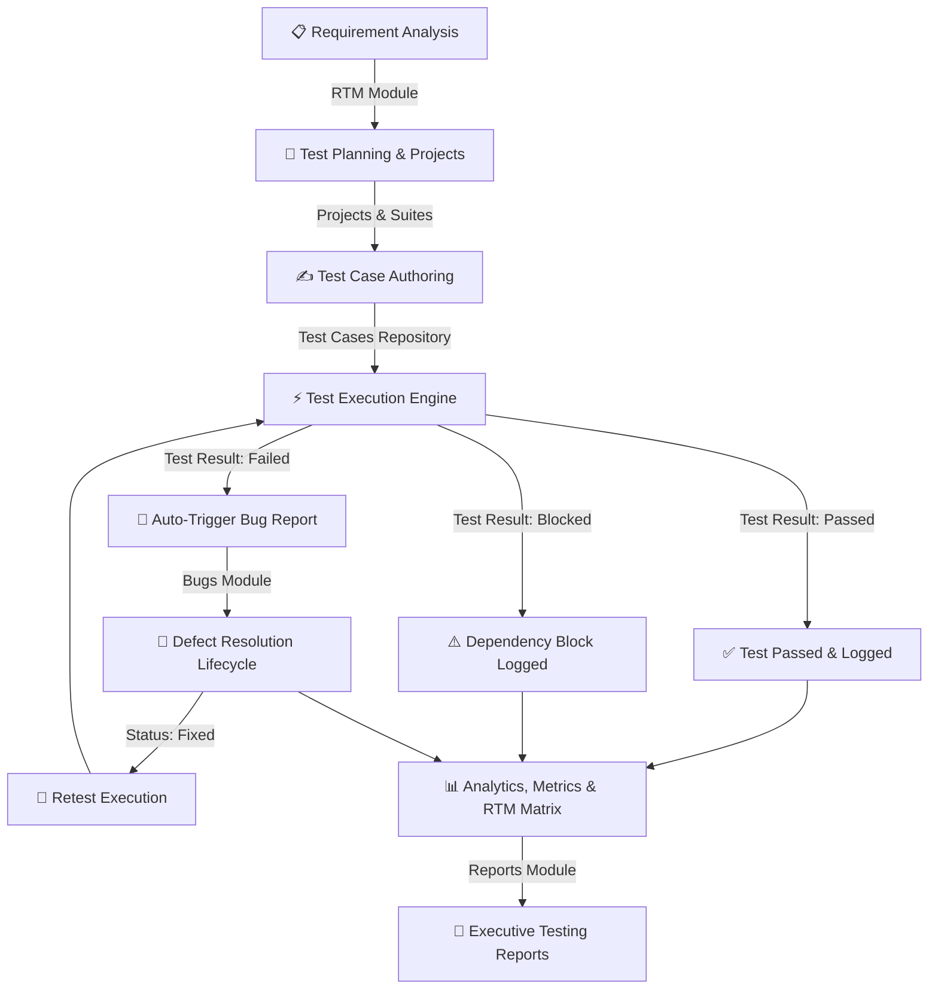

<div align="center">

<!-- ANIMATED HEADER SVG BANNER -->
<svg xmlns="http://www.w3.org/2000/svg" viewBox="0 0 900 240" width="100%" height="240">
  <defs>
    <!-- Background Gradient -->
    <linearGradient id="bgGrad" x1="0%" y1="0%" x2="100%" y2="100%">
      <stop offset="0%" stop-color="#0F172A" />
      <stop offset="50%" stop-color="#1E293B" />
      <stop offset="100%" stop-color="#0F172A" />
    </linearGradient>

    <!-- Glowing Accent Gradient -->
    <linearGradient id="glowGrad" x1="0%" y1="0%" x2="100%" y2="0%">
      <stop offset="0%" stop-color="#2563EB" />
      <stop offset="50%" stop-color="#7C3AED" />
      <stop offset="100%" stop-color="#38BDF8" />
    </linearGradient>

    <linearGradient id="badgeGrad" x1="0%" y1="0%" x2="100%" y2="100%">
      <stop offset="0%" stop-color="#3B82F6" stop-opacity="0.2" />
      <stop offset="100%" stop-color="#1D4ED8" stop-opacity="0.05" />
    </linearGradient>

    <!-- Animated Glow Filter -->
    <filter id="glow" x="-20%" y="-20%" width="140%" height="140%">
      <feGaussianBlur stdDeviation="8" result="blur" />
      <feComposite in="SourceGraphic" in2="blur" operator="over" />
    </filter>

    <!-- Floating Keyframes -->
    <style>
      @keyframes pulseGlow {
        0%, 100% { opacity: 0.4; transform: scale(1); }
        50% { opacity: 0.8; transform: scale(1.05); }
      }
      @keyframes floatParticle {
        0%, 100% { transform: translateY(0px) translateX(0px); }
        50% { transform: translateY(-12px) translateX(8px); }
      }
      @keyframes typingCursor {
        0%, 100% { opacity: 1; }
        50% { opacity: 0; }
      }
      @keyframes scanline {
        0% { transform: translateY(-100px); }
        100% { transform: translateY(300px); }
      }
      .bg-rect { fill: url(#bgGrad); rx: 16px; }
      .glowing-orbit { animation: pulseGlow 6s ease-in-out infinite; transform-origin: center; }
      .particle-1 { animation: floatParticle 5s ease-in-out infinite; }
      .particle-2 { animation: floatParticle 7s ease-in-out infinite 1s; }
      .particle-3 { animation: floatParticle 6s ease-in-out infinite 2s; }
      .cursor { animation: typingCursor 1s infinite; }
      .title-text { font-family: 'Inter', system-ui, -apple-system, sans-serif; font-weight: 800; fill: #FFFFFF; font-size: 32px; letter-spacing: -0.5px; }
      .subtitle-text { font-family: 'Inter', system-ui, -apple-system, sans-serif; font-weight: 500; fill: #94A3B8; font-size: 15px; }
      .badge-text { font-family: 'Inter', system-ui, -apple-system, sans-serif; font-weight: 600; fill: #38BDF8; font-size: 11px; letter-spacing: 1.5px; }
      .metric-label { font-family: 'Inter', system-ui, -apple-system, sans-serif; font-weight: 500; fill: #94A3B8; font-size: 11px; }
      .metric-val { font-family: 'Inter', system-ui, -apple-system, sans-serif; font-weight: 700; fill: #F8FAFC; font-size: 16px; }
    </style>
  </defs>

  <!-- Background Base -->
  <rect width="900" height="240" class="bg-rect" stroke="#334155" stroke-width="1.5" />

  <!-- Background Ambient Glow Orbs -->
  <circle cx="150" cy="60" r="90" fill="#2563EB" opacity="0.15" filter="url(#glow)" class="glowing-orbit" />
  <circle cx="780" cy="180" r="110" fill="#7C3AED" opacity="0.15" filter="url(#glow)" class="glowing-orbit" />

  <!-- Grid Pattern Overlay -->
  <g opacity="0.07" stroke="#FFFFFF" stroke-width="0.8">
    <line x1="0" y1="40" x2="900" y2="40" />
    <line x1="0" y1="80" x2="900" y2="80" />
    <line x1="0" y1="120" x2="900" y2="120" />
    <line x1="0" y1="160" x2="900" y2="160" />
    <line x1="0" y1="200" x2="900" y2="200" />
    <line x1="150" y1="0" x2="150" y2="240" />
    <line x1="300" y1="0" x2="300" y2="240" />
    <line x1="450" y1="0" x2="450" y2="240" />
    <line x1="600" y1="0" x2="600" y2="240" />
    <line x1="750" y1="0" x2="750" y2="240" />
  </g>

  <!-- Floating Particles -->
  <circle cx="220" cy="45" r="3" fill="#38BDF8" opacity="0.6" class="particle-1" />
  <circle cx="720" cy="65" r="4" fill="#818CF8" opacity="0.7" class="particle-2" />
  <circle cx="820" cy="130" r="2.5" fill="#34D399" opacity="0.5" class="particle-3" />
  <circle cx="100" cy="190" r="3.5" fill="#F472B6" opacity="0.6" class="particle-1" />

  <!-- Logo Icon Container -->
  <g transform="translate(48, 55)">
    <rect width="64" height="64" rx="16" fill="url(#glowGrad)" />
    <!-- Flask / Beaker Icon -->
    <path d="M26 18 L38 18 M32 18 L32 28 L44 44 C46 47 44 50 40 50 L24 50 C20 50 18 47 20 44 L32 28" 
          stroke="#FFFFFF" stroke-width="3" stroke-linecap="round" stroke-linejoin="round" fill="none" />
    <circle cx="28" cy="42" r="2" fill="#FFFFFF" />
    <circle cx="35" cy="38" r="1.5" fill="#FFFFFF" />
    <circle cx="36" cy="44" r="2" fill="#FFFFFF" />
  </g>

  <!-- Header Category Badge -->
  <g transform="translate(130, 48)">
    <rect width="180" height="22" rx="11" fill="url(#badgeGrad)" stroke="#38BDF8" stroke-width="1" stroke-opacity="0.4"/>
    <text x="12" y="15" class="badge-text">⚡ SEQA ACADEMIC SUITE</text>
  </g>

  <!-- Main Title -->
  <text x="130" y="105" class="title-text">Software Test Case Management System</text>

  <!-- Subtitle -->
  <text x="130" y="132" class="subtitle-text">Enterprise-Grade QA Testing, STLC Lifecycle, Defect Tracking &amp; RTM Matrix</text>

  <!-- Metrics / Badges Ribbon -->
  <g transform="translate(130, 155)">
    <!-- Metric 1: STLC Lifecycle -->
    <rect x="0" y="0" width="165" height="52" rx="10" fill="#1E293B" stroke="#334155" stroke-width="1" />
    <text x="14" y="22" class="metric-label">STLC COMPLIANCE</text>
    <text x="14" y="42" class="metric-val">100% Complete</text>
    <circle cx="145" cy="26" r="5" fill="#10B981" />

    <!-- Metric 2: LocalStorage Engine -->
    <rect x="180" y="0" width="165" height="52" rx="10" fill="#1E293B" stroke="#334155" stroke-width="1" />
    <text x="194" y="22" class="metric-label">DATA PERSISTENCE</text>
    <text x="194" y="42" class="metric-val">LocalStorage DB</text>
    <circle cx="325" cy="26" r="5" fill="#3B82F6" />

    <!-- Metric 3: Architecture -->
    <rect x="360" y="0" width="165" height="52" rx="10" fill="#1E293B" stroke="#334155" stroke-width="1" />
    <text x="374" y="22" class="metric-label">SERVER REQUIREMENT</text>
    <text x="374" y="42" class="metric-val">Zero Backend</text>
    <circle cx="505" cy="26" r="5" fill="#8B5CF6" />

    <!-- Metric 4: Dark Mode -->
    <rect x="540" y="0" width="165" height="52" rx="10" fill="#1E293B" stroke="#334155" stroke-width="1" />
    <text x="554" y="22" class="metric-label">THEME SYSTEM</text>
    <text x="554" y="42" class="metric-val">Dual Light/Dark</text>
    <circle cx="685" cy="26" r="5" fill="#F59E0B" />
  </g>
</svg>

<br/>

<!-- SHIELDS BADGES -->
<p align="center">
  
  
  
  
  
  
  
</p>

<h3>🎯 Modern Web-Based Quality Assurance &amp; Software Testing Suite</h3>
<p><i>Engineered for Software Engineering and Quality Assurance (SEQA) Academic Projects &amp; Lab Examinations</i></p>

</div>

---

## 📑 Table of Contents

- [🌟 Live Key Features](#-live-key-features)
- [⚡ Quick Start & Demo Credentials](#-quick-start--demo-credentials)
- [🔄 Software Testing Life Cycle (STLC) Workflow](#-software-testing-life-cycle-stlc-workflow)
- [📊 System Architecture](#-system-architecture)
- [📂 Module Directory & Capabilities](#-module-directory--capabilities)
- [📈 Requirement Traceability Matrix (RTM)](#-requirement-traceability-matrix-rtm)
- [💾 LocalStorage Relational Architecture](#-localstorage-relational-architecture)
- [🧪 20 Comprehensive Self-Test Cases](#-20-comprehensive-self-test-cases)
- [🎓 SEQA Viva Demonstration Script](#-seqa-viva-demonstration-script)
- [💡 20 High-Frequency Viva Q&A](#-20-high-frequency-viva-qa)
- [🔮 Future Roadmap](#-future-roadmap)

---

## 🌟 Live Key Features

```
┌──────────────────────────────────────────────────────────────────────────────────────────┐
│  🟢 PROJECT MANAGEMENT     Create, Track Versions, Progress Bars, Milestones             │
│  🧪 TEST CASES REPOSITORY   Full CRUD, Multi-Filter, Search, Numbered Steps, Duplication  │
│  ⚡ EXECUTION RUNNER        Pass/Fail/Blocked Recording, Auto Bug Generation on Failure   │
│  📦 TEST SUITE BATCHER      Regression, Smoke, Sanity Suites with Pass Rate Calculation   │
│  🐛 DEFECT LIFECYCLE        Open ➔ Assigned ➔ In Progress ➔ Fixed ➔ Retest ➔ Closed       │
│  🔗 TRACEABILITY MATRIX     REQ ➔ TC ➔ BUG End-to-End Real-Time Coverage Analysis         │
│  📊 METRICS & REPORTING     Defect Density, Pass Rate, 9 Printable Reports & CSV Exports  │
│  🌗 THEME SYSTEM            Zero-Flicker Light & Dark Mode with LocalStorage Memory       │
│  👥 ROLE-BASED ACCESS       Admin (Full), QA Tester (Execution), Developer (Bug Fixes)    │
│  💾 ZERO SERVER / PORTABLE  Single-Folder Deployment, 100% Client-Side LocalStorage Engine│
└──────────────────────────────────────────────────────────────────────────────────────────┘
```

---

## ⚡ Quick Start & Demo Credentials

### 🚀 How to Run in 5 Seconds
1. **No Installation Needed**: No Node.js, Python, PHP, or local server required.
2. **Launch**: Double-click [`index.html`](file:///c:/Users/Kunal/OneDrive/Desktop/Software%20Test%20Case%20Management%20System/index.html) in your browser (Chrome, Edge, Firefox, Safari).
3. **Auto-Initialization**: On initial launch, the system seeds **3 Projects**, **10 Test Cases**, **5 Bugs**, **3 Test Suites**, **5 Users**, and **9 Requirements**.

### 🔑 Demo Logins

| Role | Username | Password | Privileges |
| :--- | :--- | :--- | :--- |
| 🛡️ **Administrator** | `admin` | `admin123` | Unrestricted access across all modules, team settings & data reset |
| 🧪 **QA Tester** | `tester` | `tester123` | Test case creation, execution, suite runner, bug reporting & reports |
| 💻 **Developer** | `developer` | `developer123` | Bug tracking, execution history audit, quality reports |

---

## 🔄 Software Testing Life Cycle (STLC) Workflow



---

## 📊 System Architecture

```
┌───────────────────────────────────────────────────────────────────────────┐
│                           BROWSER CLIENT ENVIRONMENT                      │
├───────────────────────────────────────────────────────────────────────────┤
│  PRESENTATION LAYER                                                       │
│  ├── Responsive HTML5 UI (11 Standalone Semantic Views)                   │
│  ├── Design System Tokens, CSS Grid & Flexbox (style.css, dashboard.css)   │
│  └── Dynamic Component States, Modals, Badges, Toast & Theme Engine       │
├───────────────────────────────────────────────────────────────────────────┤
│  LOGICAL APPLICATION LAYER (ES6+ JAVASCRIPT MODULES)                      │
│  ├── auth.js         ➔ Session Guard, RBAC Route Rules                    │
│  ├── storage.js      ➔ LocalStorage CRUD, Key Namespaces, Backups         │
│  ├── testcases.js    ➔ Filtering Engine, Duplicate, Pagination, Form Validator │
│  ├── execution.js    ➔ Execution Runner, Automated Defect Converter       │
│  ├── bugs.js         ➔ Defect Lifecycle State Transitions & Audit Track  │
│  ├── rtm.js          ➔ Dynamic Coverage Analyzer (REQ ➔ TC ➔ BUG)         │
│  ├── reports.js      ➔ Chart.js Analytics Engine, CSV/JSON Exporters      │
│  └── utils.js        ➔ XSS Escaping, Date Parsers, Toasts, Pagination     │
├───────────────────────────────────────────────────────────────────────────┤
│  DATA PERSISTENCE LAYER                                                   │
│  └── Browser LocalStorage API (Isolated Namespaces: stcms_*)               │
└───────────────────────────────────────────────────────────────────────────┘
```

---

## 📂 Module Directory & Capabilities

<details open>
<summary><b>1. 🖥️ Executive Dashboard (<code>dashboard.html</code>)</b></summary>
<br>

- **8 KPI Cards**: Real-time counters for Total Projects, Total Test Cases, Passed Tests, Failed Tests, Blocked Tests, Unexecuted Tests, Open Bugs, and Critical Defects.
- **4 Chart.js Visualizations**:
  - *Test Case Status Distribution* (Doughnut Chart)
  - *Bug Lifecycle Status Distribution* (Doughnut Chart)
  - *Defect Severity Breakdown* (Bar Chart)
  - *Project Testing Progress* (Stacked Bar Chart)
- **Quality Metrics Engine**: Real-time calculation of Pass Rate %, Fail Rate %, Defect Density, and Test Coverage %.
- **Recent Activity Audit Feed**: Chronological log of team actions.

</details>

<details>
<summary><b>2. 📁 Project Management (<code>projects.html</code>)</b></summary>
<br>

- Manage software projects with Versioning, Project Manager, Date Span, and Status (`Planning`, `Active`, `Testing`, `Completed`, `On Hold`).
- Dynamic card grid showing live test case counts, bug counts, and percentage-based progress bars.
- Search and filter with deletion safety confirmation dialogs.

</details>

<details>
<summary><b>3. 🧪 Test Case Repository (<code>test-cases.html</code>)</b></summary>
<br>

- Comprehensive Test Case Metadata: Test ID (`TC001`), Project, Module, Title, Preconditions, Numbered Steps, Test Data, Expected Result, Actual Result, Priority, Severity, Type (`Functional`, `Regression`, `Smoke`, `Sanity`, `Integration`, `UI`, `Security`, `Performance`, `Compatibility`), and Assigned Tester.
- Real-time search, multi-factor filtering, pagination, and one-click duplication.
- Direct CSV export.

</details>

<details>
<summary><b>4. ⚡ Test Execution Engine (<code>test-execution.html</code>)</b></summary>
<br>

- Single-page test runner with test case selector and preconditions/steps display.
- Record execution status (`Passed`, `Failed`, `Blocked`, `Not Executed`), observed actual outcome, environment data, and comments.
- **Auto-Defect Generation**: When a test fails, a **"Report Bug"** button auto-populates the defect form with test case steps and expected results.

</details>

<details>
<summary><b>5. 📦 Test Suites (<code>test-suites.html</code>)</b></summary>
<br>

- Group test cases into logical execution bundles (e.g. *Regression Suite*, *Smoke Tests*).
- Multi-color segmented progress bars showing Passed, Failed, Blocked, and Unexecuted proportions.
- Real-time pass rate computation and batch execution triggers.

</details>

<details>
<summary><b>6. 🐛 Bug Tracking System (<code>bugs.html</code>)</b></summary>
<br>

- Complete 8-stage lifecycle: `Open` $\rightarrow$ `Assigned` $\rightarrow$ `In Progress` $\rightarrow$ `Fixed` $\rightarrow$ `Retest` $\rightarrow$ `Closed` (with `Reopened` and `Rejected` support).
- Captures Severity (`Critical`, `Major`, `Minor`, `Trivial`), Priority, Environment, Browser, OS, and Developer Comments.
- Visual lifecycle tracker in detail view.

</details>

<details>
<summary><b>7. 🔗 Requirement Traceability Matrix (<code>rtm.html</code>)</b></summary>
<br>

- Maps Business Requirements (`REQ001`) to Test Cases (`TC001`, `TC002`) and linked Defects (`BUG001`).
- Real-time coverage calculation: *Fully Covered*, *Partially Covered*, *Blocked*, or *Not Tested*.

</details>

<details>
<summary><b>8. 📊 Testing Reports & Analytics (<code>reports.html</code>)</b></summary>
<br>

- 9 Dynamic Reports: Test Execution Summary, Test Case Status, Bug Summary, Bug Severity, Bug Priority, Tester Performance, Project Progress, Failed Tests, and Open Bugs.
- Single-click CSV export, browser print formatting (`window.print()`), and full JSON repository backup.

</details>

<details>
<summary><b>9. 👥 Team Management & ⚙️ Settings (<code>team.html</code>, <code>settings.html</code>)</b></summary>
<br>

- **Team**: User CRUD, role assignments, and workload metrics.
- **Settings**: Dark/Light mode toggle, full JSON database backup/restore, activity log audit viewer, and LocalStorage quota monitor.

</details>

---

## 📈 Requirement Traceability Matrix (RTM)

```
┌──────────┬─────────────────────────────┬────────────────┬──────────────┬──────────┬───────────────────┐
│ REQ ID   │ REQUIREMENT DESCRIPTION     │ LINKED TC(S)   │ TEST STATUS  │ BUG ID   │ COVERAGE STATUS   │
├──────────┼─────────────────────────────┼────────────────┼──────────────┼──────────┼───────────────────┤
│ REQ001   │ User Authentication & Login │ TC001, TC002   │ Passed       │ None     │ 🟢 Covered        │
│ REQ002   │ Shopping Cart Management    │ TC003          │ Failed       │ BUG001   │ 🟡 Partially Cov. │
│ REQ003   │ Payment Gateway Processing  │ TC004          │ Not Executed │ BUG002   │ 🔵 Not Tested     │
│ REQ004   │ Product Search & Filtering  │ TC005          │ Passed       │ None     │ 🟢 Covered        │
│ REQ005   │ Bank Account Creation       │ TC006          │ Passed       │ None     │ 🟢 Covered        │
│ REQ006   │ Fund Transfer Operations    │ TC007          │ Blocked      │ BUG003   │ 🔴 Blocked        │
│ REQ007   │ Session Inactivity Timeout  │ TC008          │ Not Executed │ None     │ 🔵 Not Tested     │
│ REQ008   │ Student Portal Registration │ TC009          │ Passed       │ BUG004   │ 🟢 Covered        │
│ REQ009   │ Faculty Attendance Marking  │ TC010          │ Passed       │ BUG005   │ 🟢 Covered        │
└──────────┴─────────────────────────────┴────────────────┴──────────────┴──────────┴───────────────────┘
```

---

## 💾 LocalStorage Relational Architecture

The application implements a relational data model inside the browser's key-value storage:

```
stcms_projects        ➔ [ { id: "PRJ001", name: "...", status: "Active", ... } ]
       │ 1
       ├──────────────┐
       │ N            │ N
stcms_testCases  stcms_bugs ◄───────┐ (relatedTestCase)
       │ N                          │
       ├──────────────┐             │
       │ N            │ N           │
stcms_testSuites  stcms_testExecutions
       │
stcms_requirements ───► (testCaseIds: ["TC001", "TC002"])
stcms_users        ───► (assignedTo: "Rahul Sharma")
stcms_activityLog  ───► [ { id: "ACT...", user: "...", action: "...", date: "..." } ]
stcms_notifications───► [ { id: "NTF...", message: "...", read: false } ]
```

---

## 🧪 20 Comprehensive Self-Test Cases

| TC# | Objective | Test Steps | Expected Output | Status |
| :--- | :--- | :--- | :--- | :---: |
| **TC001** | Verify valid admin login | Input `admin` / `admin123` ➔ Click Sign In | Redirected to Dashboard; admin role badge displayed | `PASSED` |
| **TC002** | Verify invalid login rejection | Input `admin` / `wrongpwd` ➔ Click Sign In | Error banner: "Invalid username or password" | `PASSED` |
| **TC003** | Verify session logout | Click sidebar "Logout" button | Session cleared; redirected to `index.html` | `PASSED` |
| **TC004** | Create new project | Open Projects ➔ Add Project ➔ Fill form ➔ Save | Project card generated; count updated | `PASSED` |
| **TC005** | Edit existing project | Click Edit icon on PRJ001 ➔ Modify version ➔ Save | Updated version tag rendered immediately | `PASSED` |
| **TC006** | Delete project with confirmation | Click Delete on project ➔ Confirm modal | Record deleted; removed from LocalStorage | `PASSED` |
| **TC007** | Create test case | Open Test Cases ➔ New Test Case ➔ Save | Test case added with generated `TC*` ID | `PASSED` |
| **TC008** | Duplicate test case | Click Duplicate icon on `TC001` | Clone created with prefix `[Copy]` and unique ID | `PASSED` |
| **TC009** | Filter test cases by priority | Select "Critical" in priority dropdown | Only Critical test cases displayed in table | `PASSED` |
| **TC010** | Live test case search | Type "Authentication" in search input | Real-time table filter shows matching records | `PASSED` |
| **TC011** | Execute test case (Pass) | Open Execution ➔ Select TC001 ➔ Status "Passed" ➔ Submit | Record saved; status badge updated to green | `PASSED` |
| **TC012** | Execute test case (Fail) & bug flow | Open Execution ➔ Select TC003 ➔ Status "Failed" ➔ Submit | "Report Bug" button appears automatically | `PASSED` |
| **TC013** | Auto-populate defect from failure | Click "Report Bug" on failed execution | Bug modal opens with pre-filled steps and data | `PASSED` |
| **TC014** | Transition defect lifecycle | Open Bugs ➔ Change status Open ➔ In Progress | Bug status updated; logged in activity feed | `PASSED` |
| **TC015** | Create test suite | Open Test Suites ➔ New Suite ➔ Select TCs ➔ Save | Suite created; pass rate calculated | `PASSED` |
| **TC016** | Generate analytics report | Open Reports ➔ Select "Bug Severity" ➔ Generate | Dynamic Bar Chart & severity table rendered | `PASSED` |
| **TC017** | Export CSV data | Click "Export CSV" on Test Cases page | Spreadsheet `.csv` file downloaded | `PASSED` |
| **TC018** | Full JSON backup & restore | Export JSON in Settings ➔ Clear data ➔ Import JSON | All data restored with state intact | `PASSED` |
| **TC019** | Dark theme toggle | Click Theme Moon/Sun icon in top navigation | Dark mode applied instantly; preference saved | `PASSED` |
| **TC020** | RTM coverage calculation | Add requirement and link test cases in RTM | Coverage status calculated automatically | `PASSED` |

---

## 🎓 SEQA Viva Demonstration Script

```
1. INTRODUCTION (30s)
   "Good morning, examiners. Today I present the Software Test Case Management System (STCMS),
   a client-side Quality Assurance platform covering the complete Software Testing Life Cycle (STLC)."

2. AUTHENTICATION & RBAC (30s)
   "We begin at the login screen, which supports Role-Based Access Control for Admins, QA Testers,
   and Developers using demo credentials or custom user accounts."

3. EXECUTIVE DASHBOARD (1m)
   "Logging in as Admin reveals real-time QA metrics: Test Coverage %, Defect Density, and Pass Rate %,
   along with interactive Chart.js visualizations that update dynamically from LocalStorage."

4. TEST CASE AUTHORING & DUPLICATION (1m)
   "Under Test Cases, we can author test cases with numbered steps, preconditions, priority, and type.
   We also support multi-filtering, pagination, and rapid test duplication."

5. TEST RUNNER & AUTO-DEFECT WORKFLOW (1m 30s)
   "In Test Execution, we select a test case and record results. When marking a test as 'Failed',
   the system automatically generates a pre-filled Bug Report, eliminating manual data entry."

6. DEFECT LIFECYCLE & RTM MATRIX (1m 30s)
   "Under Bug Tracking, we track defects through the complete lifecycle. The Requirement Traceability
   Matrix (RTM) links business requirements to test cases and defects to ensure full test coverage."

7. ANALYTICS, EXPORT & DARK MODE (30s)
   "Finally, the Reports module generates 9 dynamic report types with CSV/JSON export,
   complemented by an audit activity log and dark mode support."
```

---

## 💡 20 High-Frequency Viva Q&A

<details>
<summary><b>Q1: What is the Software Testing Life Cycle (STLC) and how is it implemented?</b></summary>
<br>
<b>Answer:</b> STLC is the systematic sequence of testing activities. This system implements every phase: <i>Requirement Analysis</i> (RTM Module), <i>Test Planning</i> (Projects & Suites), <i>Test Case Development</i> (Test Cases Module), <i>Test Execution</i> (Execution Runner), <i>Defect Tracking</i> (Bug Tracking Module), and <i>Test Closure</i> (Reports & Dashboard Analytics).
</details>

<details>
<summary><b>Q2: What is the Requirement Traceability Matrix (RTM) and why is it important?</b></summary>
<br>
<b>Answer:</b> RTM is a grid mapping business requirements to corresponding test cases and defects. It ensures 100% test coverage, identifies untested requirements, and prevents requirement gaps before deployment.
</details>

<details>
<summary><b>Q3: How is Defect Density calculated in this application?</b></summary>
<br>
<b>Answer:</b> $\text{Defect Density} = \frac{\text{Total Confirmed Defects}}{\text{Total Test Cases}}$. It provides a quantitative measure of software reliability and risk across modules.
</details>

<details>
<summary><b>Q4: What is the difference between Priority and Severity?</b></summary>
<br>
<b>Answer:</b> <b>Severity</b> is the technical impact of a defect on system functionality (Critical, Major, Minor, Trivial). <b>Priority</b> defines the business urgency with which the defect must be fixed (High, Medium, Low).
</details>

<details>
<summary><b>Q5: How does this application prevent Cross-Site Scripting (XSS)?</b></summary>
<br>
<b>Answer:</b> All user input is sanitized before DOM injection using our <code>escapeHTML()</code> utility function, which converts HTML characters (<code>&lt;</code>, <code>&gt;</code>, <code>&amp;</code>, <code>&quot;</code>) into safe entity representations.
</details>

<details>
<summary><b>Q6: What is the difference between Smoke, Sanity, and Regression testing?</b></summary>
<br>
<b>Answer:</b> <i>Smoke Testing</i> verifies basic build stability; <i>Sanity Testing</i> quickly validates specific bug fixes; <i>Regression Testing</i> re-runs existing test suites to ensure new changes haven't broken existing features.
</details>

<details>
<summary><b>Q7: How does LocalStorage handle data relationships without a backend database?</b></summary>
<br>
<b>Answer:</b> Data entities are stored in JSON format under isolated namespaces (<code>stcms_projects</code>, <code>stcms_testCases</code>, etc.). Relational integrity is maintained by referencing unique primary keys (e.g. <code>PRJ001</code>, <code>TC001</code>, <code>BUG001</code>).
</details>

<details>
<summary><b>Q8: What is Test Coverage and how is it calculated here?</b></summary>
<br>
<b>Answer:</b> $\text{Test Coverage} = \frac{\text{Executed Test Cases}}{\text{Total Test Cases}} \times 100$. It measures the proportion of planned tests that have been completed.
</details>

<details>
<summary><b>Q9: How does the client-side CSV export function work?</b></summary>
<br>
<b>Answer:</b> JavaScript compiles data arrays into comma-separated text strings, constructs a <code>Blob</code> with MIME type <code>text/csv</code>, and triggers a download using a dynamically created <code>&lt;a&gt;</code> element with an object URL.
</details>

<details>
<summary><b>Q10: What is a Blocked test case?</b></summary>
<br>
<b>Answer:</b> A test case is marked as <b>Blocked</b> when an external blocker (such as an offline third-party API or an unfulfilled precondition) prevents the tester from executing the test steps.
</details>

<details>
<summary><b>Q11: What is the difference between Verification and Validation?</b></summary>
<br>
<b>Answer:</b> <b>Verification</b> asks "Are we building the product right?" (reviews, walkthroughs, static checks). <b>Validation</b> asks "Are we building the right product?" (dynamic test execution against requirements).
</details>

<details>
<summary><b>Q12: What is Boundary Value Analysis (BVA)?</b></summary>
<br>
<b>Answer:</b> A black-box test design technique focused on testing values at the boundaries of equivalence partitions (minimum, just above minimum, nominal, just below maximum, maximum).
</details>

<details>
<summary><b>Q13: How are unauthenticated users prevented from accessing dashboard pages?</b></summary>
<br>
<b>Answer:</b> Each page runs a route guard in <code>auth.js</code> during <code>DOMContentLoaded</code>. If <code>stcms_currentUser</code> is absent, the user is redirected to <code>index.html</code>.
</details>

<details>
<summary><b>Q14: What is the defect lifecycle supported by STCMS?</b></summary>
<br>
<b>Answer:</b> <code>Open</code> $\rightarrow$ <code>Assigned</code> $\rightarrow$ <code>In Progress</code> $\rightarrow$ <code>Fixed</code> $\rightarrow$ <code>Retest</code> $\rightarrow$ <code>Closed</code>, with branches for <code>Reopened</code> and <code>Rejected</code>.
</details>

<details>
<summary><b>Q15: How does the system handle audit logging?</b></summary>
<br>
<b>Answer:</b> Every CRUD operation, execution, and status update calls <code>addActivity()</code>, which records the user, action, module, timestamp, and details into the <code>stcms_activityLog</code> array.
</details>

<details>
<summary><b>Q16: What is Equivalence Class Partitioning (ECP)?</b></summary>
<br>
<b>Answer:</b> A test technique that divides input data into valid and invalid partitions, assuming all values within a partition will be processed similarly by the system.
</details>

<details>
<summary><b>Q17: What are Non-Functional Requirements (NFR) in this project?</b></summary>
<br>
<b>Answer:</b> Client-side sub-second response times, responsive UI layout, persistent theme state, form validation, and complete data portability via JSON backup.
</details>

<details>
<summary><b>Q18: What is Positive vs. Negative Testing?</b></summary>
<br>
<b>Answer:</b> Positive testing verifies expected behavior with valid inputs; Negative testing verifies that the application handles invalid inputs and edge cases gracefully without crashing.
</details>

<details>
<summary><b>Q19: What is the storage limit of LocalStorage and how is it monitored?</b></summary>
<br>
<b>Answer:</b> LocalStorage typically provides ~5MB per domain origin. The Settings page calculates and displays real-time storage usage in kilobytes.
</details>

<details>
<summary><b>Q20: Why is LocalStorage authentication suitable for demos but not production?</b></summary>
<br>
<b>Answer:</b> LocalStorage lacks HTTP-only protections and is accessible to client-side scripts. Production applications require server-side session management with encrypted passwords and HTTP-only cookie tokens.
</details>

---

## 🔮 Future Roadmap

1. **Cloud Backend & Database**: Migrate storage to Node.js/Express with MongoDB/PostgreSQL.
2. **CI/CD Pipeline Integration**: Webhooks for GitHub Actions / Jenkins to trigger test suites on build.
3. **Automated Test Results**: REST API endpoints for Selenium, Cypress, Playwright, and JUnit reports.
4. **Rich Attachments**: Upload screenshots, screen recordings, and logs to cloud storage.
5. **Real-time Collaboration**: WebSocket integration for live team updates and notifications.

---

<div align="center">
  <b>Software Test Case Management System (STCMS)</b><br>
  Academic Project for Software Engineering and Quality Assurance (SEQA)<br>
  Built with HTML5, CSS3, JavaScript ES6+, Bootstrap 5 &amp; Chart.js
</div>
